# SharpBotz
## Arena
### Creating A Simple Arena
Begin constructing an `Arena` by calling the static `Sized` method,
which takes an `ArenaWidth` and an `ArenaHeight`. Finish by calling `Build`:   
```csharp
Arena.Sized(
        ArenaWidth.Is(3),
        ArenaHeight.Is(3))
    .Build();
```
This creates a 3 by 3 grid.  
The outer tiles are set up as *Walls*  
```text
Wall Wall Wall
Wall      Wall
Wall Wall Wall
```
Both `ArenaWidth` and `ArenaHeight` must be greater than 2  
### Adding Walls
This can be achieved in the following way:  
```csharp
Arena
    .Sized(
        ArenaWidth.Is(5),
        ArenaHeight.Is(3))
    .AddWallAt(1, 1)
    .AddWallAt(3, 1)
    .Build();
```
This creates:  
```text
Wall Wall Wall Wall Wall
Wall Wall      Wall Wall
Wall Wall Wall Wall Wall
```
Placing a wall where one is already present:  
```csharp
Arena
    .Sized(
        ArenaWidth.Is(5),
        ArenaHeight.Is(3))
    .AddWallAt(1, 1)
    .AddWallAt(1, 1)
    .Build();
```
Throws a:  
```csharp
ArenaConstructionException
```
Containing the following message:  
```text
"Tried adding a wall to a non empty tile at [1, 1].";
```
## Bot
### Modules
Every module is defined by a `ModuleId`.  
```csharp
ModuleId.Is("my-module")
```
A `ModuleId` cannot be `null`, `string.Empty` or consist only of whitespace.  
#### Reactor
A reactor is responsible for supplying the energy required to power other modules.

It is created by specifying its maximum output and a `ModuleId` (supplied as a string).  
```csharp
Reactor.Named("reactor")
    .MaximumOutput(10);
```
A reactor with a maximum output of zero or negative throws upon construction.  
A reactor with a maximum output of 1 has a weight of 4.  
Increasing maximum output adds weight along an approximately quadratic curve.   
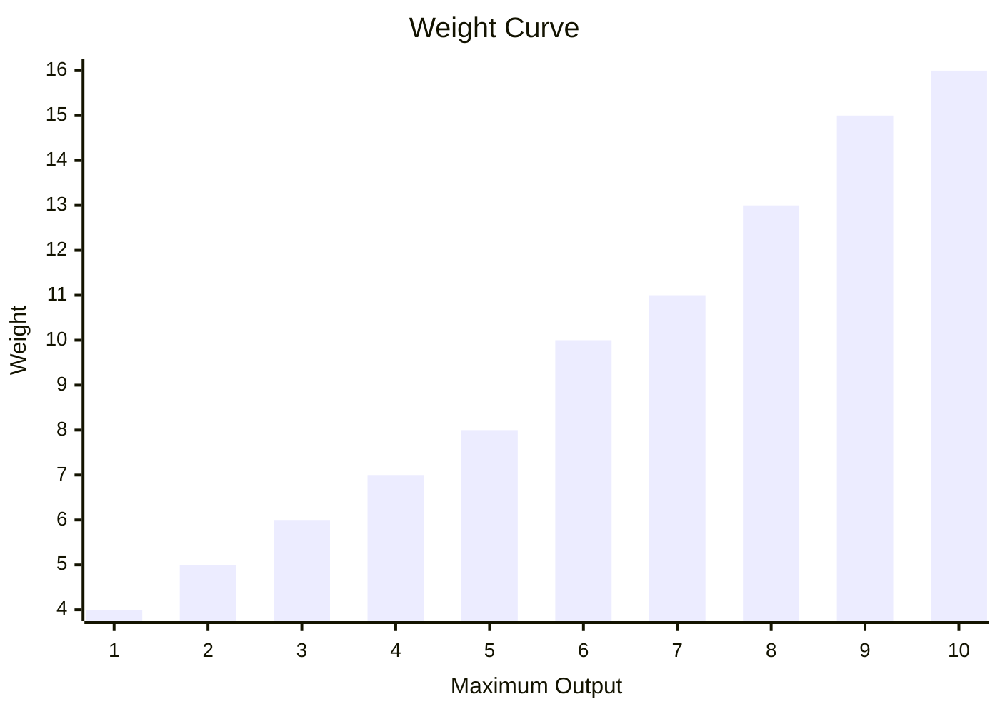
Requesting more than a reactor's maximum output overloads it.
The reactor produces no power, and every excess unit of requested output deals 2 damage to the bot.  
Multiple reactors can be installed in a `ModuleRack`.

The rack's total maximum output is the sum of all the reactors' maximum outputs.  
```csharp
ModuleRack.Create(
    Reactor.Named("reactor-one").MaximumOutput(10),
    Reactor.Named("reactor-two").MaximumOutput(10));
```
#### Battery
A battery is where a bot stores excess power generated by a reactor.

It is created by specifying its capacity and a `ModuleId` (supplied as a string).  
```csharp
Battery.Named("battery").Capacity(100);
```
Its initial charge is zero.  
A battery with a capacity of zero or negative throws upon construction.  
A battery with a capacity of 1 has a weight of 3.  
Every 25 extra capacity after the first 25 adds another 1 weight to the module.   
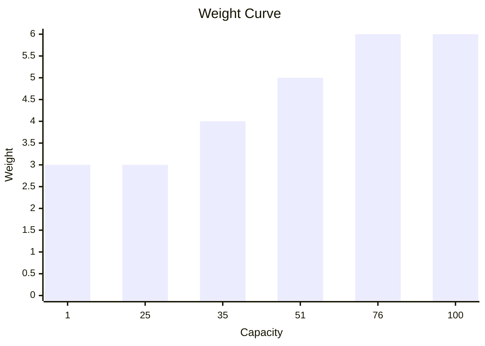
Multiple batteries can be installed in a `ModuleRack`.

The rack's total energy capacity is the sum of all the batteries' capacities.  
```csharp
ModuleRack.Create(
    Battery.Named("battery-one").Capacity(25),
    Battery.Named("battery-two").Capacity(25));
```
#### What Is A Powered Module
We already saw the modules related to energy generation and storage.  
All other modules consume power. They are all powered modules.
  
#### Drive
A drive is needed to move your bot across the arena.


It is created with its thrust per power and maximum power, along with a ModuleId.
Thrust per power determines how much force each unit of supplied power produces.  
```csharp
Drive.Named("drive")
    .ThrustPerPower(10)
    .MaximumPower(5);
```
Call `Move` on the module info from your BotBrain to request a speed.
The required power is the requested speed multiplied by the bot's loaded weight, divided by thrust per power and rounded up.

For a bot weighing 50 with 10 thrust per power, every unit of speed needs 5 power.
Requesting speed 2 allocates 10 power, which exceeds this drive's maximum power of 5.  
A powered drive moves the bot in the direction it is facing.  
Supplying more than the drive's maximum power overcharges it.
The movement still happens, but every excess unit of power deals 3 damage to the bot.  
A drive's base weight is 3.
Supporting more power adds weight following the triangular number curve.  
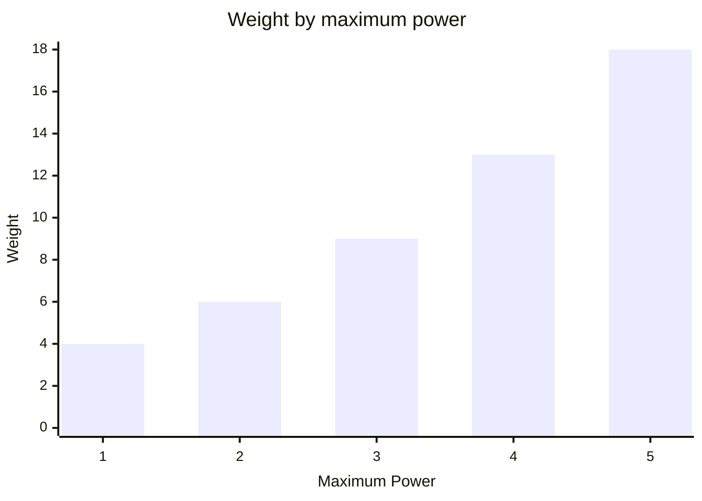
Thrust per power up to 10 is included in that weight.
Above 10, every two additional thrust per power add 1 weight, rounded up.  
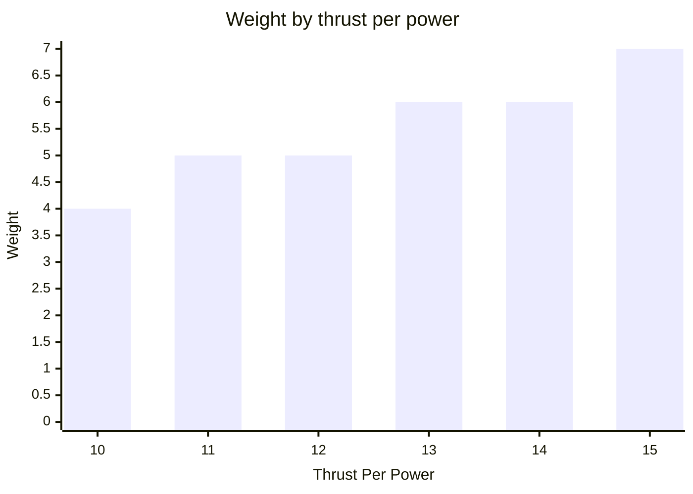
#### Rotator
A rotator is needed in order to turn your bot.


It is created by passing in its torque per power, maximum power and rotation along with a ModuleId (supplied as string).  
```csharp
Rotator.Named("rotator")
    .TorquePerPower(10)
    .MaximumPower(5)
    .Left();
```
Multiple rotators can be installed in the same ModuleRack.
Each rotator has its own direction and ModuleId.  
```csharp
ModuleRack.Create(
    Rotator.Named("left-rotator")
        .TorquePerPower(10)
        .MaximumPower(1)
        .Left(),
    Rotator.Named("right-rotator")
        .TorquePerPower(10)
        .MaximumPower(1)
        .Right());
```
Supplying enough power can rotate a bot more than once in a single turn.  
Supplying more than the rotator's maximum power overcharges it.
The rotation still happens, but every excess unit of power deals 3 damage to the bot.  
A rotator's base weight is 3.
Supporting more power adds weight following the triangular number curve.  

Torque per power up to 10 is included in that weight.
Above 10, every two additional torque per power add 1 weight, rounded up.  
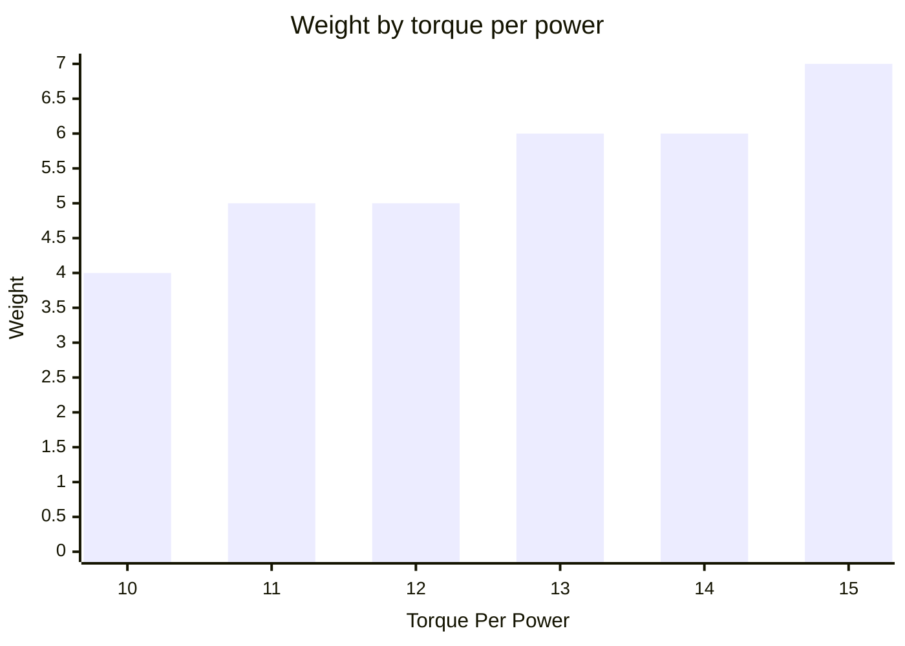
#### Melee
A melee weapon damages the bot directly in front of your bot.


It is created with its damage per power and maximum power, along with a ModuleId.  
```csharp
Melee.Named("melee")
    .DamagePerPower(10)
    .MaximumPower(5);
```
Call `Hit` on the module info from your BotBrain to request an attack.
The requested damage is rounded up to the next whole unit of power.  
Supplying more than the melee weapon's maximum power overcharges it.
The attack still lands, but every excess unit of power deals 3 damage to the attacking bot.  
A melee weapon's base weight is 2.
Higher damage per power adds weight following a squared curve.  
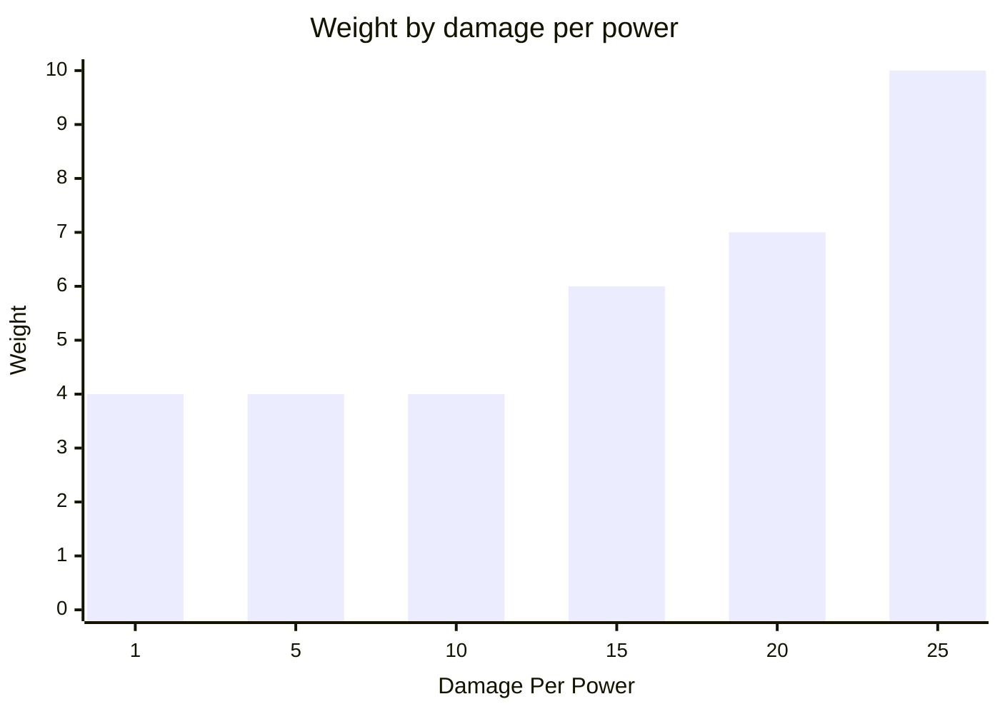
Supporting more power adds weight following the triangular number curve.
This example keeps damage per power at 20.  
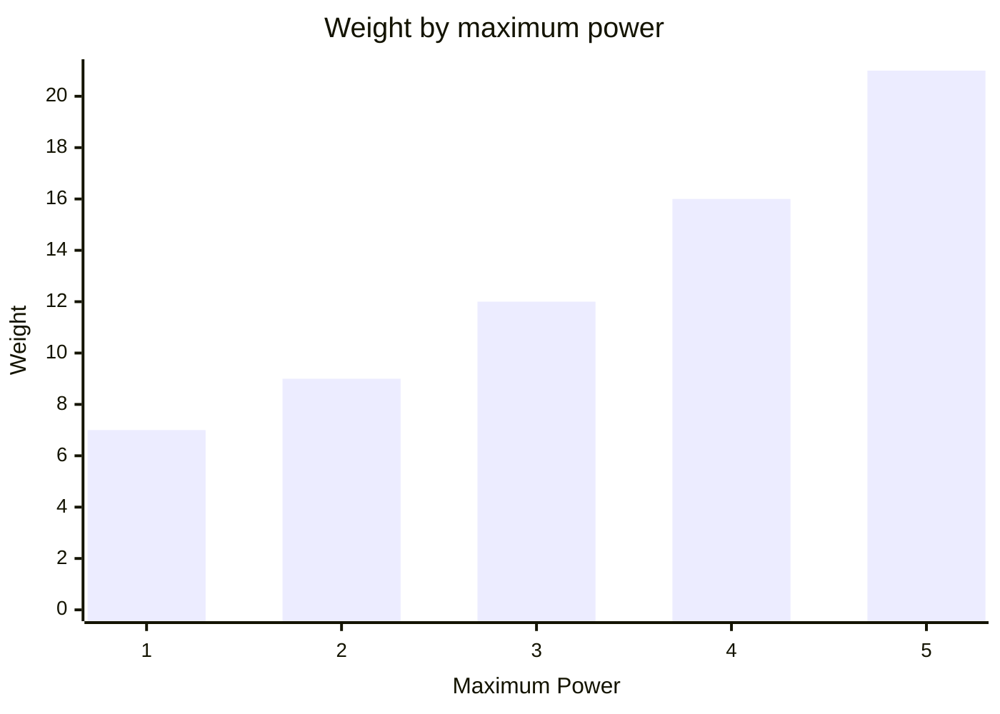
#### Ranged
A ranged weapon fires in the direction your bot is facing.
The first bot in its path is hit, provided it is within range and no wall blocks the shot.


It is created with its range, damage per power and maximum power, along with a ModuleId.  
```csharp
Ranged.Named("ranged")
    .Range(3)
    .DamagePerPower(10)
    .MaximumPower(5);
```
Call `Fire` on the module info from your BotBrain to request a shot.
The requested damage is rounded up to the next whole unit of power.  
Supplying more than the ranged weapon's maximum power overcharges it.
The shot still lands, but every excess unit of power deals 3 damage to the attacking bot.  
A ranged weapon's base weight is 3.
Increasing range adds weight following the triangular number curve.  
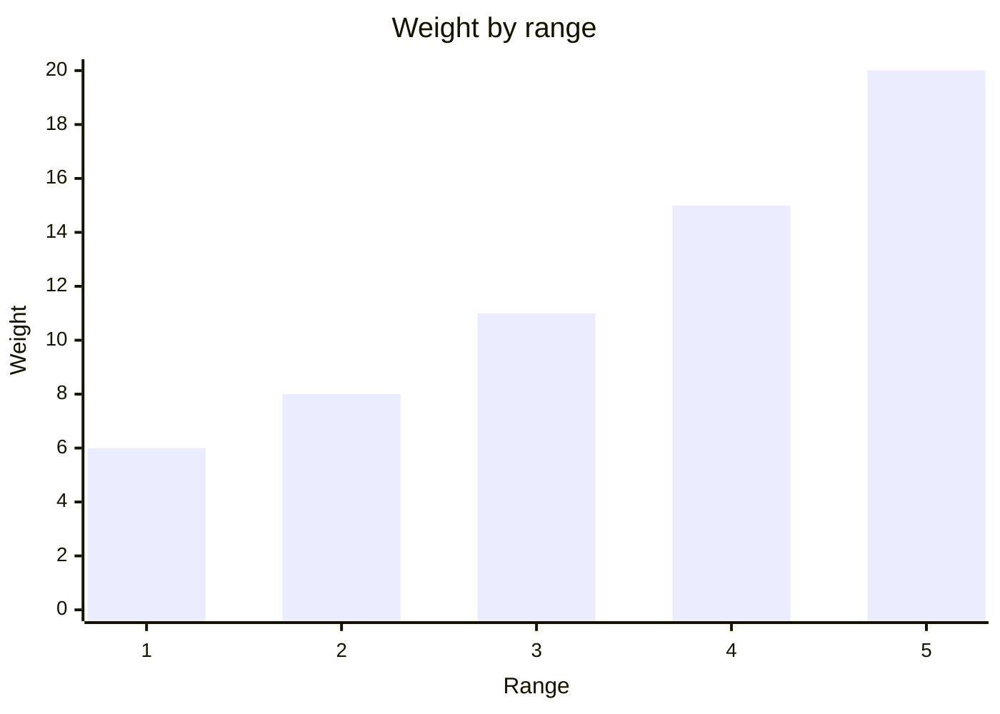
Higher damage per power adds weight following a squared curve.
This example uses a range of 1 and maximum power of 1.  
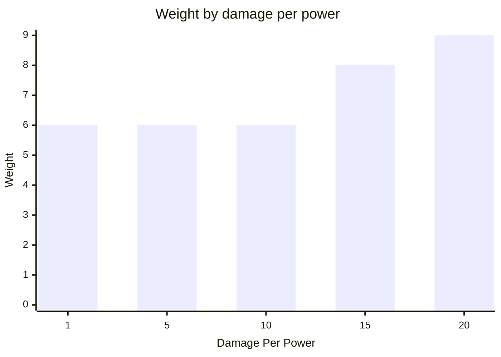
Supporting more power adds weight following the triangular number curve.
This example uses a range of 3 and damage per power of 20.  
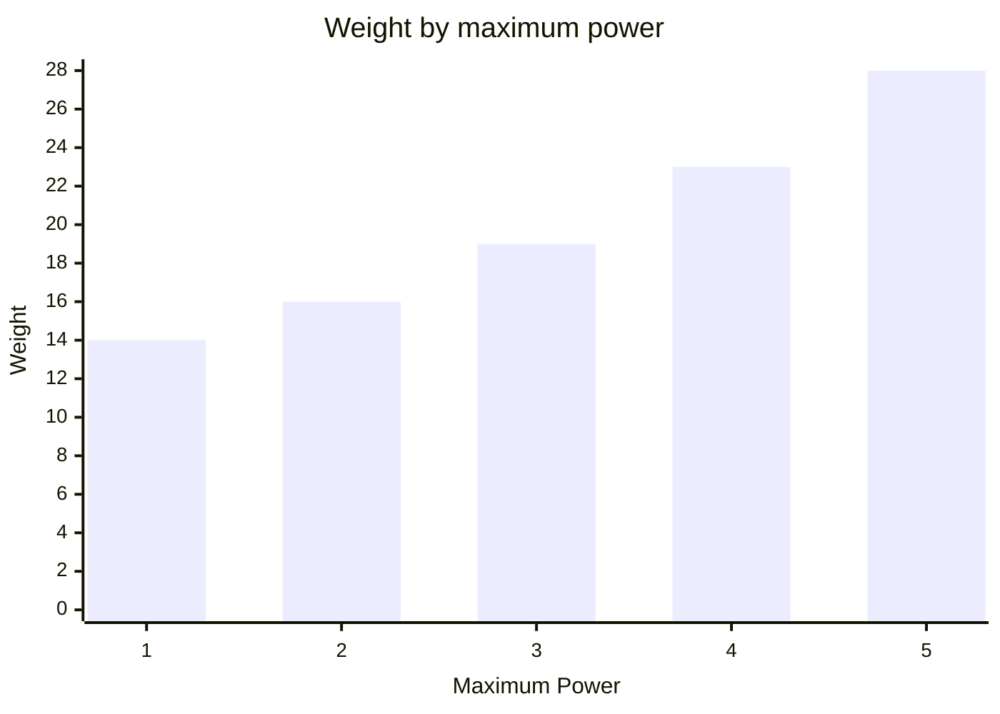
#### Scanner
A scanner lets your bot observe a square area around itself on the following turn.


It is created with the power required per unit of range and its maximum power, along with a ModuleId.  
```csharp
Scanner.Named("scanner")
    .PowerPerRange(2)
    .MaximumPower(10);
```
Call `Scan` on the module info from your BotBrain to request a scan.
Its power consumption is the requested range multiplied by power per range.  
Supplying more than the scanner's maximum power overcharges it.
The scan is still available on the following turn, but every excess unit of power deals 3 damage to the bot.  
Scan coordinates are relative to the observing bot, which is always at `[0, 0]`.
Positive Y points ahead, positive X points to the bot's right, negative Y points behind, and negative X points to its left.
A range-two scan therefore covers coordinates from `[-2, -2]` through `[2, 2]`.  
```csharp
public static ScanResult ReadOwnBot(BotScan scan) =>
    scan[0, 0];
```
A scan rotates with the observing bot. `[0, 1]` is therefore always directly ahead, regardless of the bot's arena direction.
The `Facing` value in a bot scan result remains an absolute arena direction.

In this example the observer faces left. A target one arena tile above it is on the observer's right and therefore appears at `[1, 0]`:  
```csharp
public static ScanResult ReadTileToTheBotsRight(BotScan scan) =>
    scan[1, 0];
```
A scanner's base weight is 2.
Supporting a larger maximum range adds weight following the triangular number curve.  
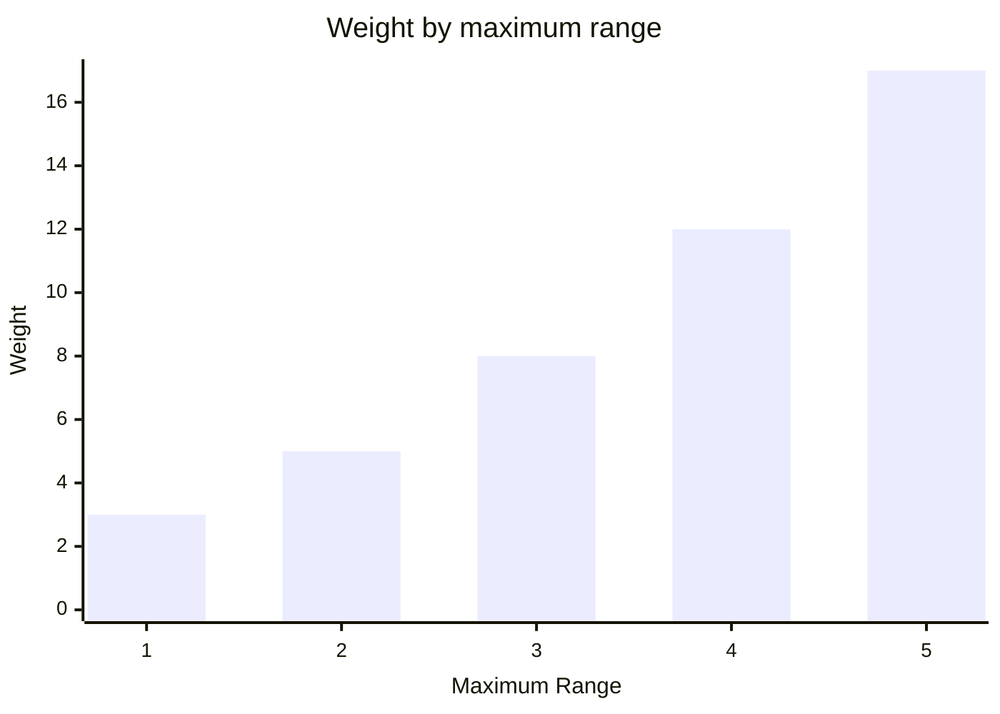
A scanner's standard efficiency is 3 power per range.
Reducing the required power adds weight. This example keeps maximum range at 5.  
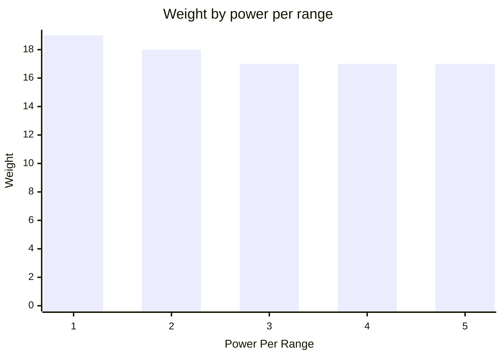
### Building A Bot Brain
A bot brain decides what its bot will do each turn.
Create one by inheriting from `BotBrain` and implementing `RoutePower`.

`ModuleControl` provides information about the bot's installed modules.
Calling a module action creates a power intention; it does not immediately perform that action.
Return those intentions together in a `PowerPlan`.

This brain asks its drive to move one tile, then asks its reactor to generate exactly the power that movement requires:  
```csharp
public class MoveForwardBrain : BotBrain
{
    protected override PowerPlan RoutePower(
        ModuleControl modules,
        BotObservation observation)
    {
        var reactor = modules.RequireModule<ReactorInfo>();
        var drive = modules.RequireModule<DrivingInfo>();
        var movement = drive.Move(speed: 1);

        return PowerPlan.From(
            reactor.SetOutput(movement.Power),
            movement);
    }
}
```
The game world calls the brain once per turn and resolves the returned plan.
`BotObservation` contains what the bot observed on the previous turn and can be used to make later brains react to their surroundings.  
A brain is installed in a bot together with the module rack it controls:  
```csharp
public static Bot CreateBot() =>
    Bot.Named("move-forward")
        .Brain(new MoveForwardBrain())
        .Rack(ModuleRack.Create(
            Reactor.Named("reactor").MaximumOutput(1),
            Drive.Named("drive")
                .ThrustPerPower(100)
                .MaximumPower(1)));
```
### Example Module Racks
Every module rack includes a chassis weighing 10, even when no modules are installed:  
```csharp
ModuleRack.Create();
```
This rack weighs **10**.  
A small mobile rack combines a one-power reactor with a drive.
Its high thrust efficiency lets it move the loaded chassis using that single unit of power:  
```csharp
ModuleRack.Create(
    Reactor.Named("reactor").MaximumOutput(1),
    Drive.Named("drive")
        .ThrustPerPower(100)
        .MaximumPower(1));
```
This rack weighs **63**.  
A close-combat rack can move, scan its surroundings, and strike an adjacent bot.
Its battery stores unused reactor output for later turns:  
```csharp
ModuleRack.Create(
    Reactor.Named("reactor").MaximumOutput(3),
    Battery.Named("battery").Capacity(10),
    Drive.Named("drive")
        .ThrustPerPower(100)
        .MaximumPower(1),
    Melee.Named("melee")
        .DamagePerPower(20)
        .MaximumPower(1),
    Scanner.Named("scanner")
        .PowerPerRange(1)
        .MaximumPower(1));
```
This rack weighs **80**, leaving 20 weight available for future upgrades.  
## Scenario
A scenario describes repeatable initial arena terrain and bot placement.  
### Arena Definition
```csharp
Scenario.Named("My Scenario")
    .Arena(arena)
    .MaximumTurns(20)
    .CompletesWhen(_ => false);
```
### Adding Bots
This can be achieved in the following way:  
```csharp
Scenario.Named("Botz")
    .Arena(Arena.Sized(
            ArenaWidth.Is(5),
            ArenaHeight.Is(3))
        .Build())
    .MaximumTurns(20)
    .CompletesWhen(_ => false)
    .Spawn(() => new DummyBot())
        .At(1, 1)
        .Facing(Direction.Up)
    .Spawn(() => new DummyBot())
        .At(3, 1)
        .Facing(Direction.Up);
```
This creates:  
```text
Wall Wall Wall Wall Wall
Wall  ↑↑        ↑↑  Wall
Wall Wall Wall Wall Wall
```
### Maximum Bot Weight
A Scenario can define the maximum bot weight allowed.  
```csharp
Scenario.Named("My Scenario")
    .Arena(arena)
    .MaximumTurns(20)
    .CompletesWhen(_ => false)
    .MaximumBotWeight(1);
```
Using the following bot in that scenario:  
```csharp
Bot.Named("Heavy")
    .Brain(new DummyBrain())
    .Rack(ModuleRack.Create(
        Drive.Named("drive")
            .ThrustPerPower(10)
            .MaximumPower(5)));
```
Causes `CreateWorld` to throw:  
```csharp
ArgumentException
```
```csharp
$"A bot cannot weigh more than 1. Heavy's module rack weighs 28. (Parameter 'placement')";
```
## Game World
A game world contains the mutable state of a running game.  
### Creating A Game World
A game world is created from a scenario containing its arena terrain and initial bot placements.
A seed can be supplied to make the game repeatable.  
```csharp
Scenario.Named("Repeatable game")
    .Arena(Arena.Sized(
            ArenaWidth.Is(3),
            ArenaHeight.Is(3))
        .Build())
    .MaximumTurns(20)
    .CompletesWhen(_ => false)
    .Spawn(() => new DummyBot())
        .At(1, 1)
        .Facing(Direction.Right)
    .CreateWorld(seed: 1234);
```
A newly created game starts at turn one.  
### Advancing Turns
Updating the game world advances it by one turn.  
```csharp
world.Update();
```
