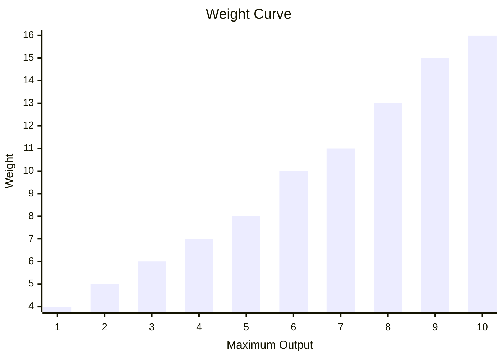

# Reactor
A reactor is responsible for supplying the energy required to power other modules.

It is created by specifying its maximum output and a `ModuleId` (supplied as a string).  
```csharp
Reactor.Named("reactor")
    .MaximumOutput(10);
```
A reactor with a maximum output of zero or negative throws upon construction.  
A reactor with a maximum output of 1 has a weight of 4.  
Increasing maximum output adds weight along an approximately quadratic curve.   

Requesting more than a reactor's maximum output overloads it.
The reactor produces no power, and every excess unit of requested output deals 2 damage to the bot.  
Multiple reactors can be installed in a `ModuleRack`.

The rack's total maximum output is the sum of all the reactors' maximum outputs.  
```csharp
ModuleRack.Create(
    Reactor.Named("reactor-one").MaximumOutput(10),
    Reactor.Named("reactor-two").MaximumOutput(10));
```
