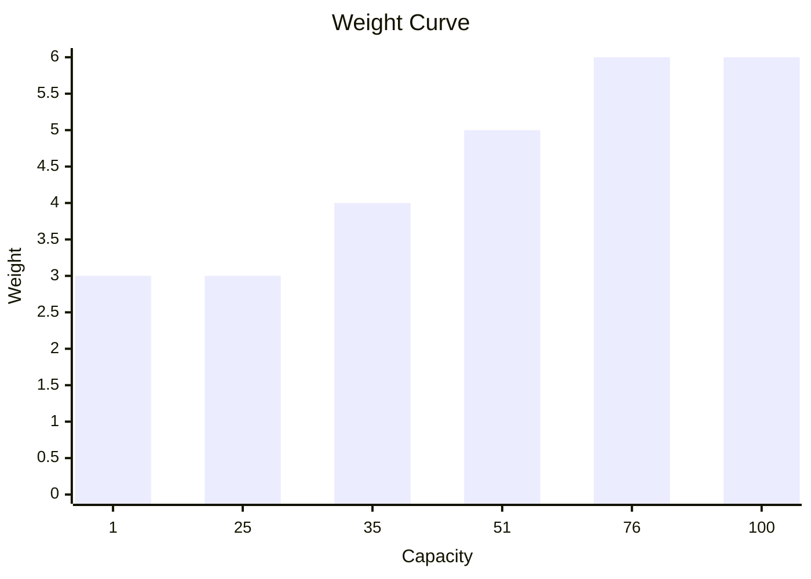

# Battery
A battery is where a Bot stores excess power generated by a Reactor.

It is created by passing in it's capacity along with a ModuleId (supplied as string).  
```csharp
Battery.Named("battery").Capacity(100);
```
It's initial Charge is set to zero.  
A battery with a capacity of zero or negative throws upon construction.  
A battery with a capacity of 1 has a weight of 3.  
Every 25 extra capacity after the first 25 adds another 1 weight to the module.   

Multiple batteries can be installed in a ModuleRack.

The total energy capacity of the rack is then the sum of all Battery capacities.  
```csharp
ModuleRack.Create(
    Battery.Named("battery-one").Capacity(25),
    Battery.Named("battery-two").Capacity(25));
```
