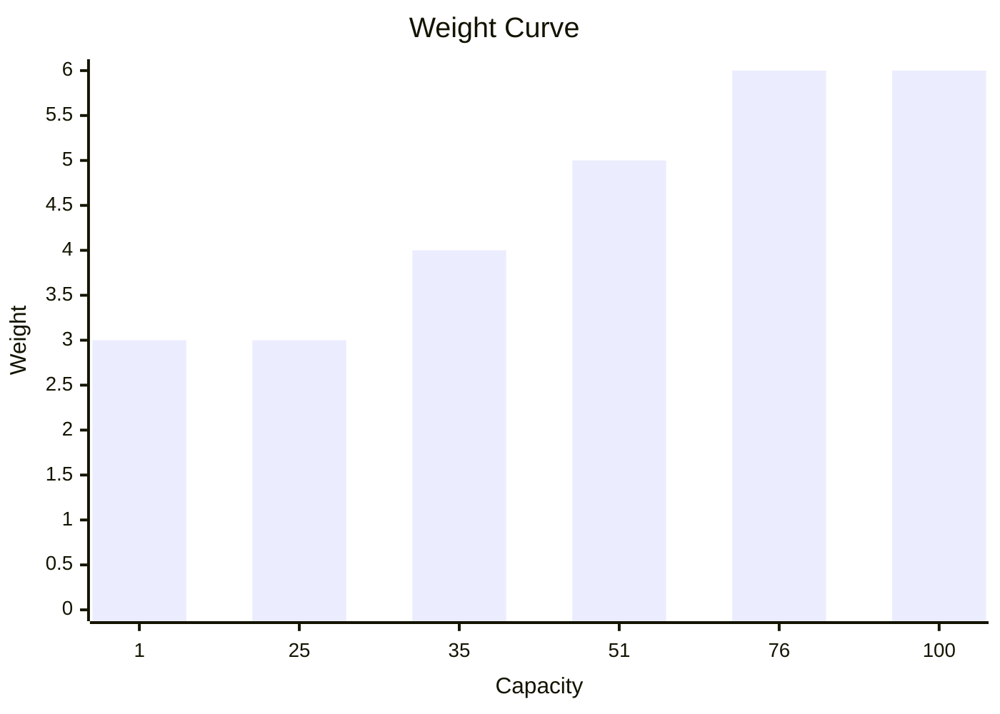

# Battery
A battery is where a bot stores excess power generated by a reactor.

It is created by specifying its capacity and a `ModuleId` (supplied as a string).  
```csharp
Battery.Named("battery").Capacity(100);
```
Its initial charge is zero.  
A battery with a capacity of zero or negative throws upon construction.  
A battery with a capacity of 1 has a weight of 3.  
Every 25 extra capacity after the first 25 adds another 1 weight to the module.   

Multiple batteries can be installed in a `ModuleRack`.

The rack's total energy capacity is the sum of all the batteries' capacities.  
```csharp
ModuleRack.Create(
    Battery.Named("battery-one").Capacity(25),
    Battery.Named("battery-two").Capacity(25));
```
