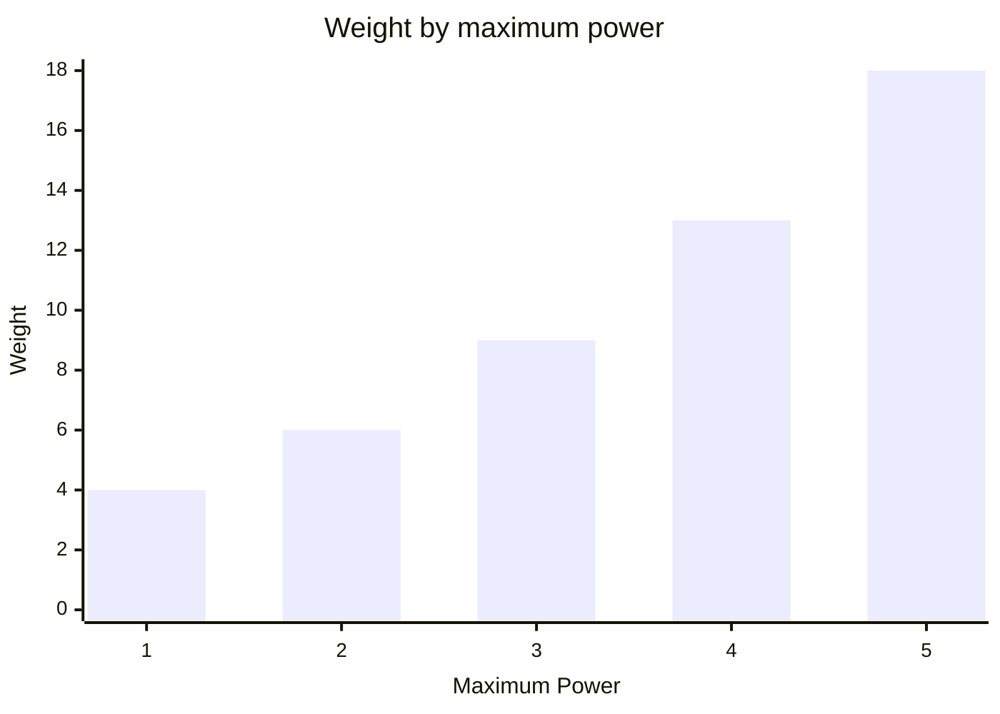
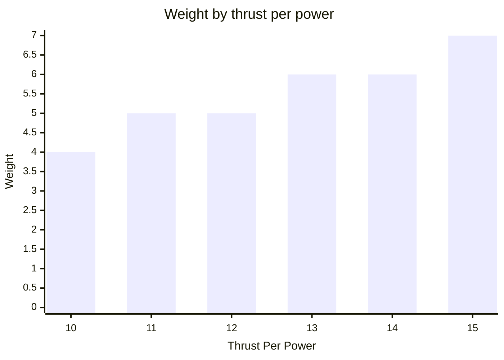

# Drive
A drive is needed to move your bot across the arena.


It is created with its thrust per power and maximum power, along with a ModuleId.
Thrust per power determines how much force each unit of supplied power produces.  
```csharp
Drive.Named("drive")
    .ThrustPerPower(10)
    .MaximumPower(5);
```
Call `Move` on the module info from your BotBrain to request a speed.
The required power is the requested speed multiplied by the bot's loaded weight, divided by thrust per power and rounded up.

For a bot weighing 50 with 10 thrust per power, every unit of speed needs 5 power.
Requesting speed 2 allocates 10 power, which exceeds this drive's maximum power of 5.  
A powered drive moves the bot in the direction it is facing.  
Supplying more than the drive's maximum power overcharges it.
The movement still happens, but every excess unit of power deals 3 damage to the bot.  
A drive's base weight is 3.
Supporting more power adds weight following the triangular number curve.  

Thrust per power up to 10 is included in that weight.
Above 10, every two additional thrust per power add 1 weight, rounded up.  

