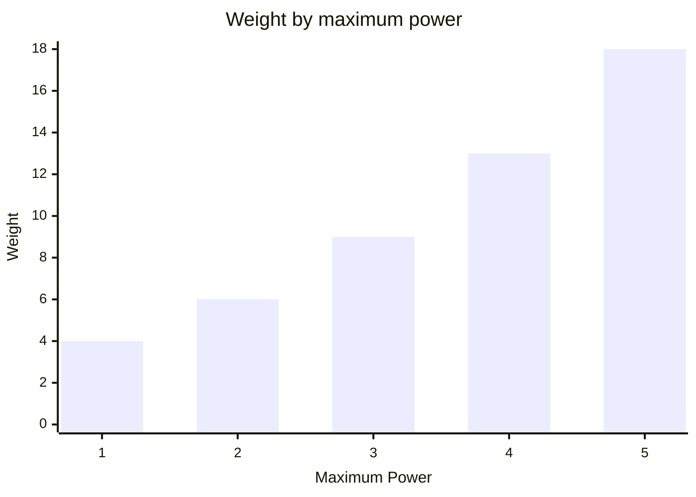
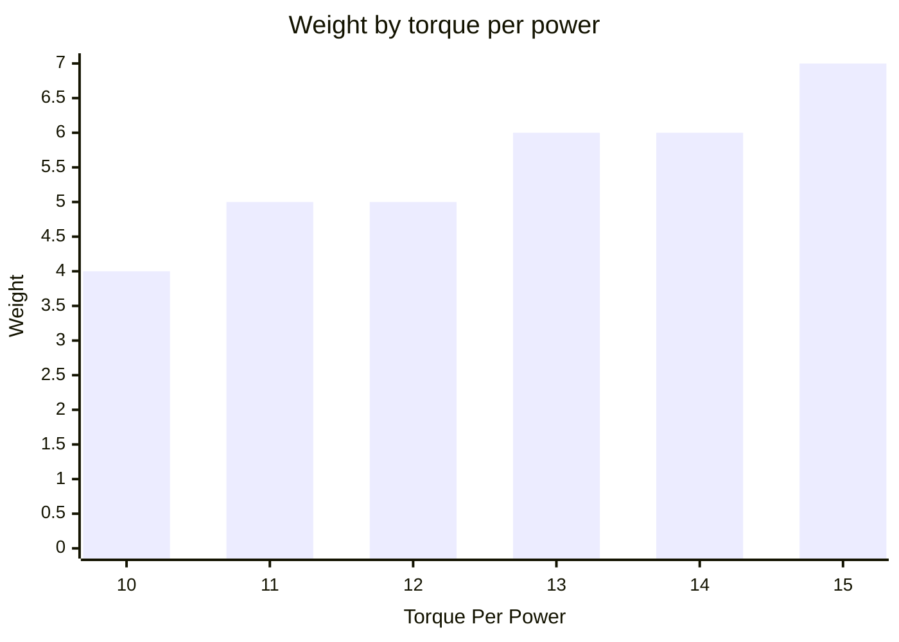

# Rotator
A rotator is needed in order to turn your bot.


It is created by passing in its torque per power, maximum power and rotation along with a ModuleId (supplied as string).  
```csharp
Rotator.Named("rotator")
    .TorquePerPower(10)
    .MaximumPower(5)
    .Left();
```
Multiple rotators can be installed in the same ModuleRack.
Each rotator has its own direction and ModuleId.  
```csharp
ModuleRack.Create(
    Rotator.Named("left-rotator")
        .TorquePerPower(10)
        .MaximumPower(1)
        .Left(),
    Rotator.Named("right-rotator")
        .TorquePerPower(10)
        .MaximumPower(1)
        .Right());
```
Supplying enough power can rotate a bot more than once in a single turn.  
Supplying more than the rotator's maximum power overcharges it.
The rotation still happens, but every excess unit of power deals 3 damage to the bot.  
A rotator's base weight is 3.
Supporting more power adds weight following the triangular number curve.  

Torque per power up to 10 is included in that weight.
Above 10, every two additional torque per power add 1 weight, rounded up.  

