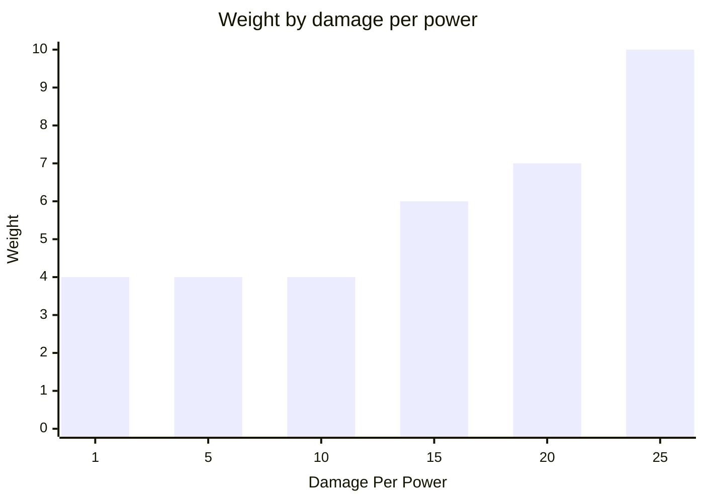
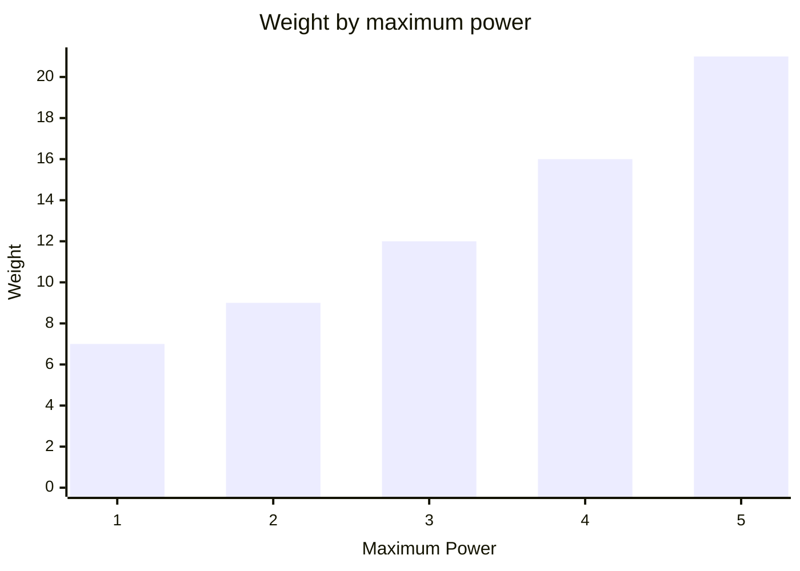

# Melee
A melee weapon damages the bot directly in front of your bot.


It is created with its damage per power and maximum power, along with a ModuleId.  
```csharp
Melee.Named("melee")
    .DamagePerPower(10)
    .MaximumPower(5);
```
Call `Hit` on the module info from your BotBrain to request an attack.
The requested damage is rounded up to the next whole unit of power.  
Supplying more than the melee weapon's maximum power overcharges it.
The attack still lands, but every excess unit of power deals 3 damage to the attacking bot.  
A melee weapon's base weight is 2.
Higher damage per power adds weight following a squared curve.  

Supporting more power adds weight following the triangular number curve.
This example keeps damage per power at 20.  

