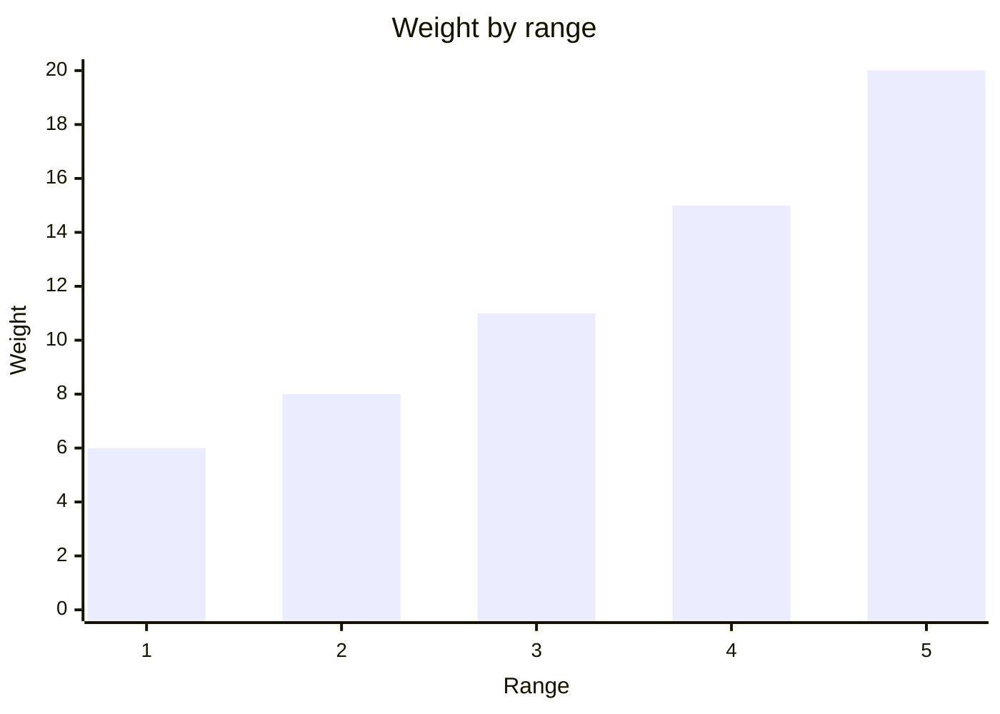
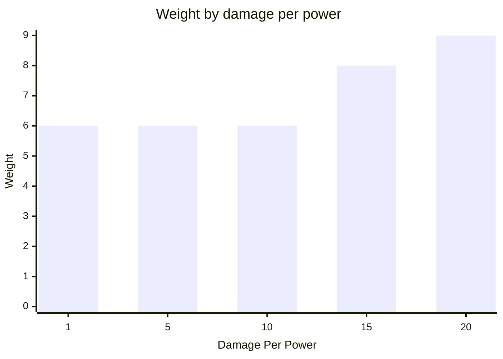
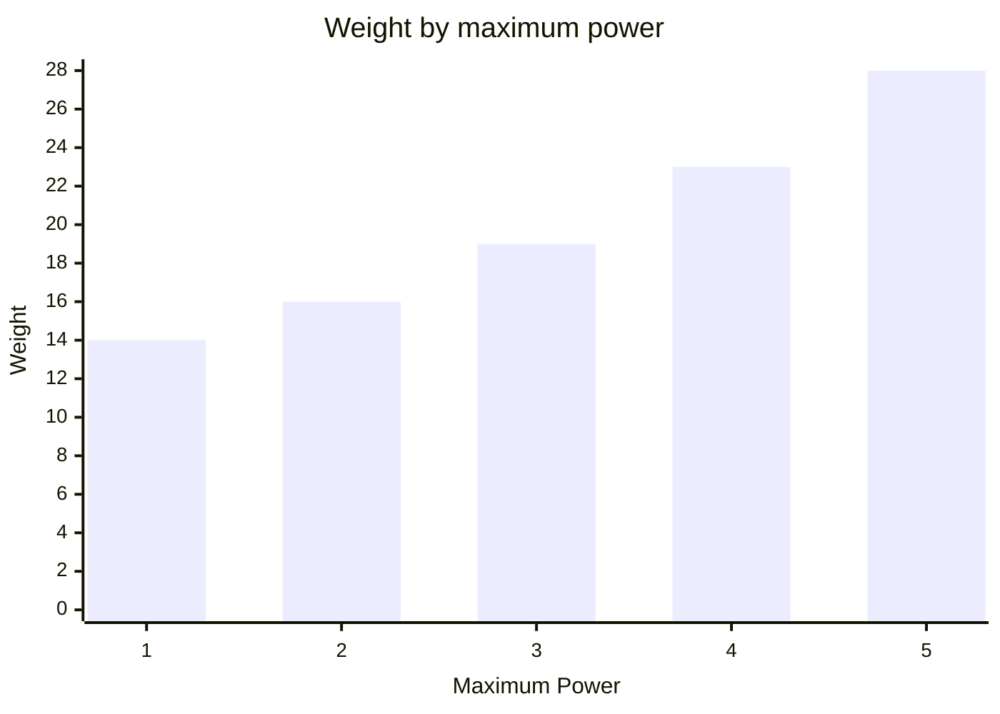

# Ranged
A ranged weapon fires in the direction your bot is facing.
The first bot in its path is hit, provided it is within range and no wall blocks the shot.


It is created with its range, damage per power and maximum power, along with a ModuleId.  
```csharp
Ranged.Named("ranged")
    .Range(3)
    .DamagePerPower(10)
    .MaximumPower(5);
```
Call `Fire` on the module info from your BotBrain to request a shot.
The requested damage is rounded up to the next whole unit of power.  
Supplying more than the ranged weapon's maximum power overcharges it.
The shot still lands, but every excess unit of power deals 3 damage to the attacking bot.  
A ranged weapon's base weight is 3.
Increasing range adds weight following the triangular number curve.  

Higher damage per power adds weight following a squared curve.
This example uses a range of 1 and maximum power of 1.  

Supporting more power adds weight following the triangular number curve.
This example uses a range of 3 and damage per power of 20.  

