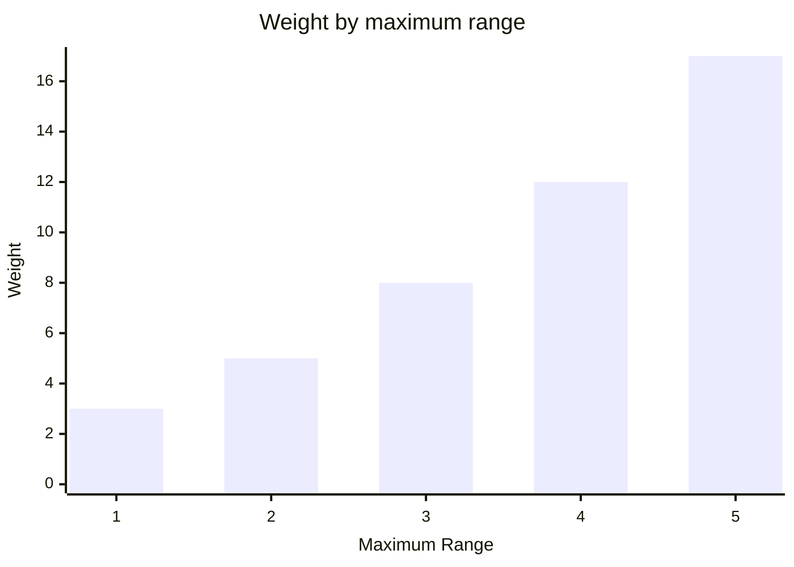
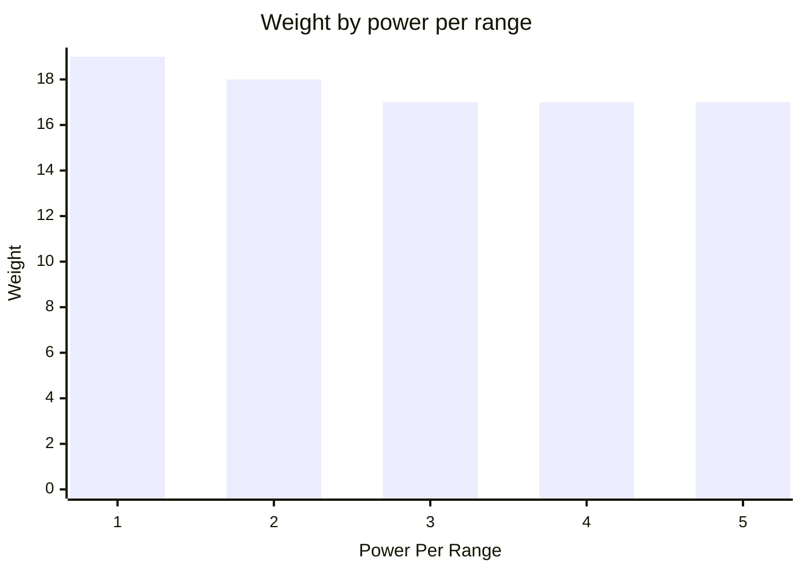

# Scanner
A scanner lets your bot observe a square area around itself on the following turn.


It is created with the power required per unit of range and its maximum power, along with a ModuleId.  
```csharp
Scanner.Named("scanner")
    .PowerPerRange(2)
    .MaximumPower(10);
```
Call `Scan` on the module info from your BotBrain to request a scan.
Its power consumption is the requested range multiplied by power per range.  
Supplying more than the scanner's maximum power overcharges it.
The scan is still available on the following turn, but every excess unit of power deals 3 damage to the bot.  
Scan coordinates are relative to the observing bot, which is always at `[0, 0]` and faces toward the top of the scan.
Negative Y points ahead, positive X points to the bot's right, positive Y points behind, and negative X points to its left.
A range-two scan therefore covers coordinates from `[-2, -2]` through `[2, 2]`.  
```csharp
public static ScanResult ReadOwnBot(BotScan scan) =>
    scan[0, 0];
```
A scan rotates with the observing bot. `[0, -1]` is therefore always directly ahead, regardless of the bot's arena direction.
The `Facing` value in a bot scan result remains an absolute arena direction.

In this example the observer faces left. A target one arena tile above it is on the observer's right and therefore appears at `[1, 0]`:  
```csharp
public static ScanResult ReadTileToTheBotsRight(BotScan scan) =>
    scan[1, 0];
```
A scanner's base weight is 2.
Supporting a larger maximum range adds weight following the triangular number curve.  

A scanner's standard efficiency is 3 power per range.
Reducing the required power adds weight. This example keeps maximum range at 5.  

