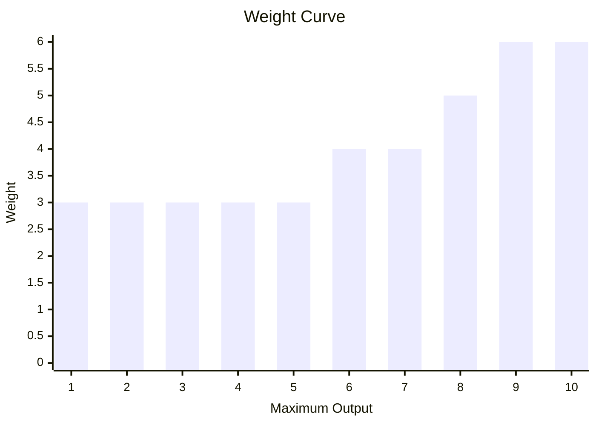
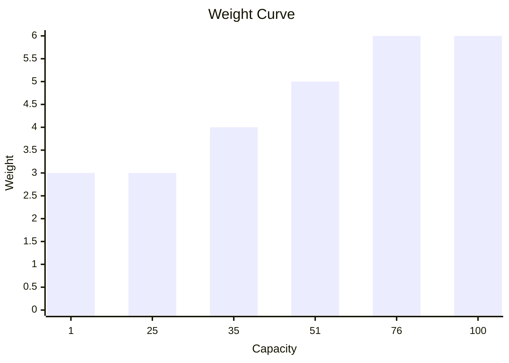
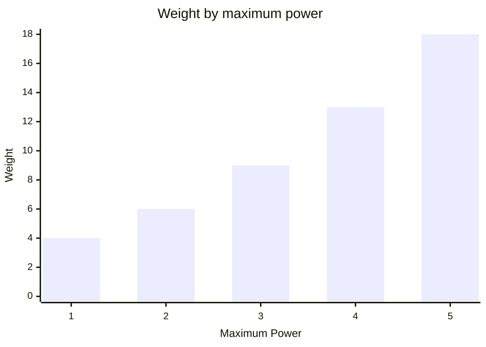
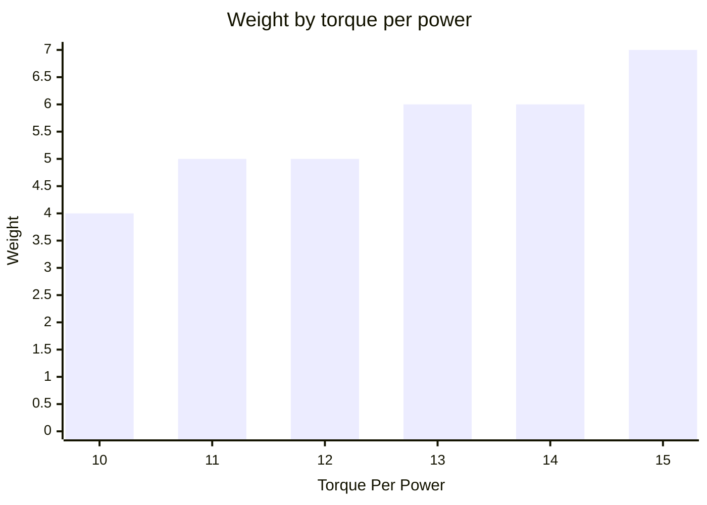
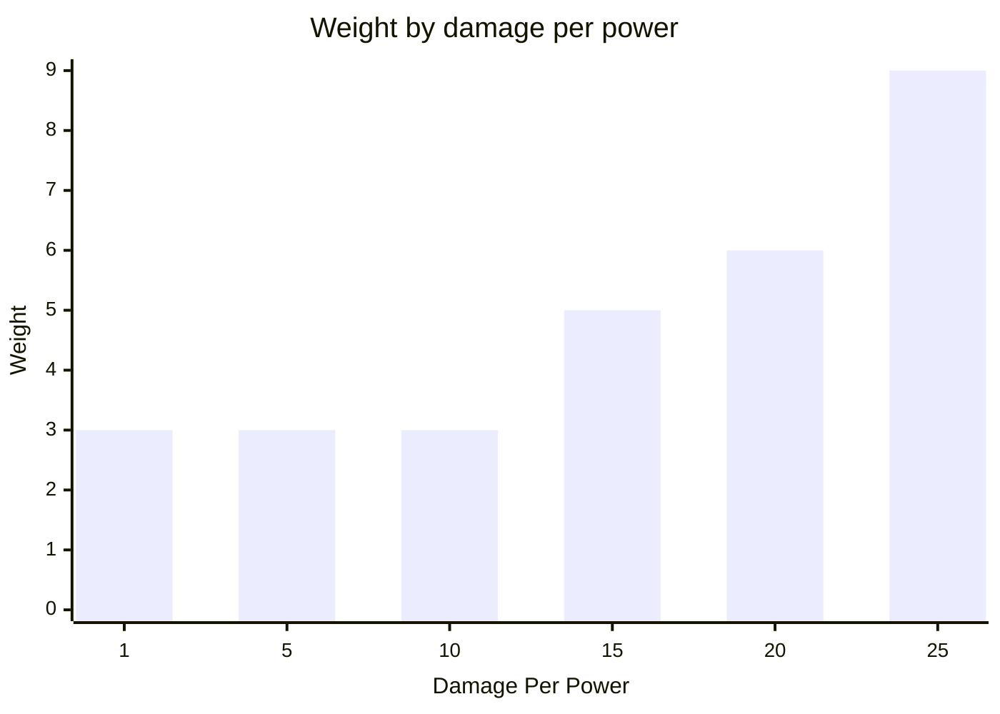
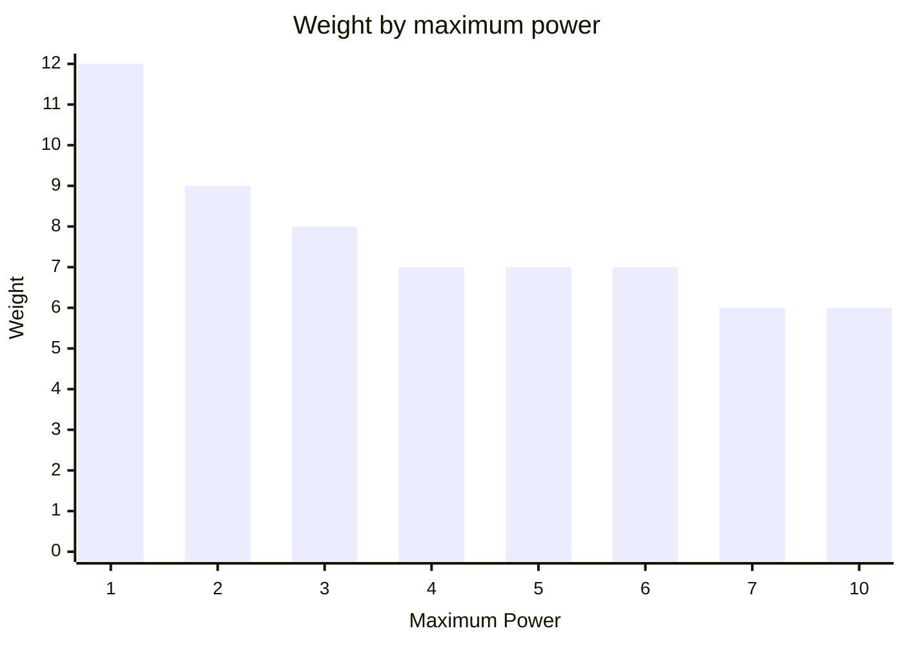
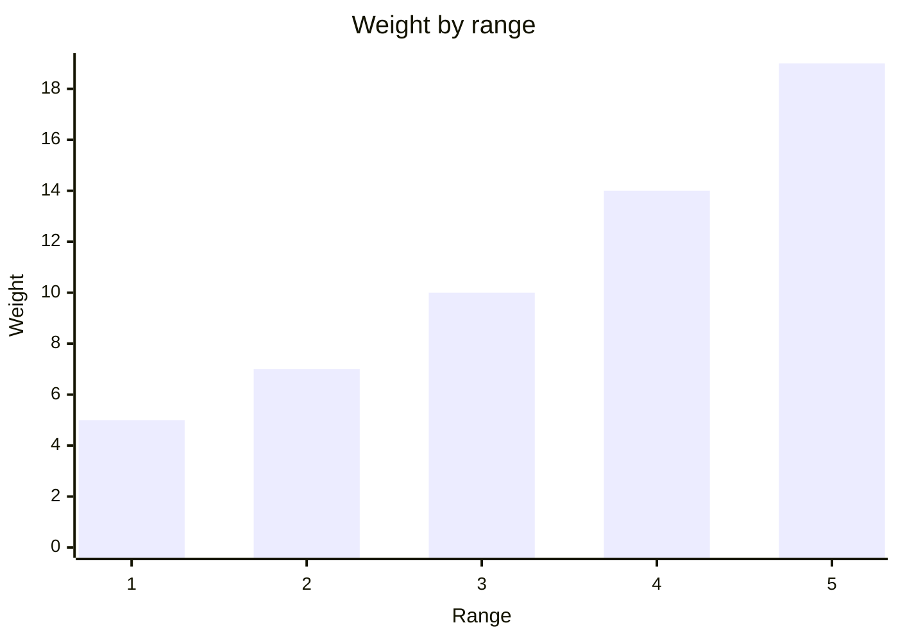
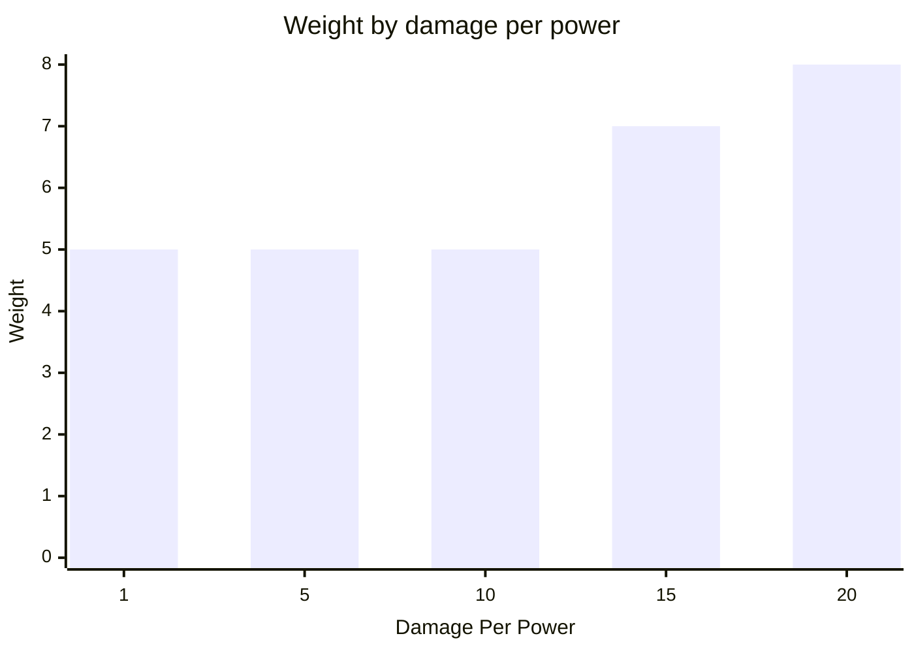
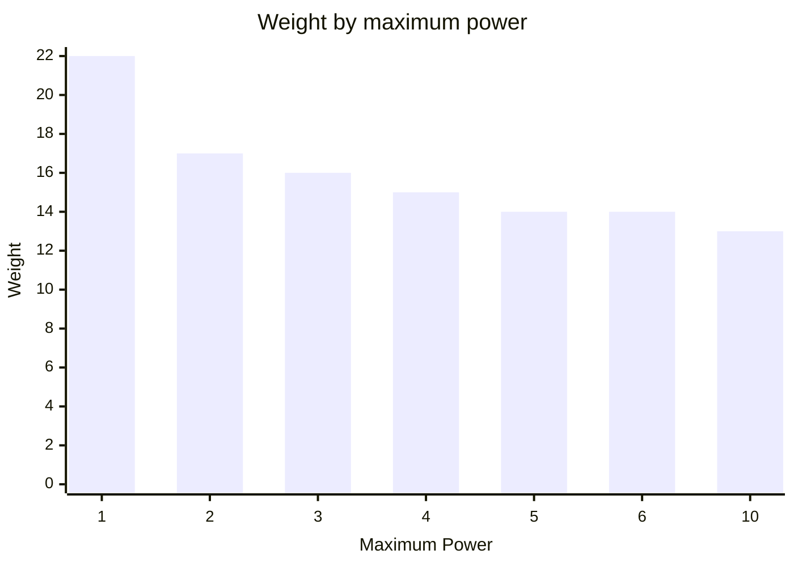
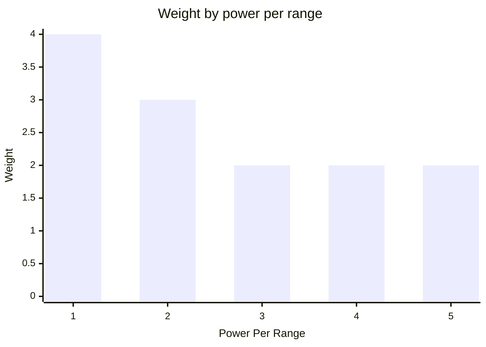

# SharpBotz
## Arena
### Creating A Simple Arena
Construct an `Arena` by calling the static `Create` method,
which takes an `ArenaWidth` and an `ArenaHeight` as arguments:   
```csharp
Arena.Sized(
        ArenaWidth.Is(3),
        ArenaHeight.Is(3))
    .Build();
```
This creates a 3 by 3 grid.  
The outer tiles are set up as *Walls*  
```text
Wall Wall Wall
Wall      Wall
Wall Wall Wall
```
Both `ArenaWidth` and `ArenaHeight` must be greater than 2  
### Adding Walls
This can be achieved in the following way:  
```csharp
Arena
    .Sized(
        ArenaWidth.Is(5),
        ArenaHeight.Is(3))
    .AddWallAt(1, 1)
    .AddWallAt(3, 1)
    .Build();
```
This creates:  
```text
Wall Wall Wall Wall Wall
Wall Wall      Wall Wall
Wall Wall Wall Wall Wall
```
Placing a wall where one is already present:  
```csharp
Arena
    .Sized(
        ArenaWidth.Is(5),
        ArenaHeight.Is(3))
    .AddWallAt(1, 1)
    .AddWallAt(1, 1)
    .Build();
```
Throws a:  
```csharp
ArenaConstructionException
```
Containing the following message:  
```text
"Tried adding a wall to a non empty tile at [1, 1].";
```
## Bot
### Modules
Every module is defined by a `ModuleId`.  
```csharp
ModuleId.Is("my-module")
```
A `ModuleId` can not be `null`, `string.Empty` or consist only of whitespace.  
#### Reactor
A reactor is responsible for supplying the energy required to power other modules.

It is created by passing in it's maximum output along with a ModuleId (supplied as string).  
```csharp
Reactor.Named("reactor")
   .MaximumOutput(10);
```
It's initial current output is set to maximum output.  
A reactor with a maximum output of zero or negative throws upon construction.  
A reactor with a maximum output of 1 has a weight of 3.  
Increasing maximum output adds more weight exponentialy.   

Multiple rectors can be installed in a ModuleRack.

The total maximum output of the rack is then the sum of all reactors maximum outputs.  
```csharp
ModuleRack.Create(
    Reactor.Named("reactor-one").MaximumOutput(10),
    Reactor.Named("reactor-two").MaximumOutput(10));
```
#### Battery
A battery is where a Bot stores excess power generated by a Reactor.

It is created by passing in it's capacity along with a ModuleId (supplied as string).  
```csharp
Battery.Named("battery").Capacity(100);
```
It's initial Charge is set to zero.  
A battery with a capacity of zero or negative throws upon construction.  
A battery with a capacity of 1 has a weight of 3.  
Every 25 extra capacity after the first 25 adds another 1 weight to the module.   

Multiple batteries can be installed in a ModuleRack.

The total energy capacity of the rack is then the sum of all Battery capacities.  
```csharp
ModuleRack.Create(
    Battery.Named("battery-one").Capacity(25),
    Battery.Named("battery-two").Capacity(25));
```
#### What Is A Powered Module
We already saw the modules related to energy generation and storage.  
All other modules consume power. The are all powered modules.
  
#### Drive
A drive is needed in order to move your board across the arena.


It is created by passing in it's thrustPerPower and maximumPower along with a ModuleId (supplied as string).  
```csharp
Drive.Named("drive")
   .ThrustPerPower(10)
   .MaximumPower(15);
```
TODO.  
#### Rotator
A rotator is needed in order to turn your bot.


It is created by passing in its torque per power, maximum power and rotation along with a ModuleId (supplied as string).  
```csharp
Rotator.Named("rotator")
            .TorquePerPower(10)
            .MaximumPower(15)
            .Left();
```
Multiple rotators can be installed in the same ModuleRack.
Each rotator has its own direction and ModuleId.  
```csharp
ModuleRack.Create(
            Rotator.Named("left-rotator")
                .TorquePerPower(10)
                .MaximumPower(1)
                .Left(),
            Rotator.Named("right-rotator")
                .TorquePerPower(10)
                .MaximumPower(1)
                .Right());
```
Supplying enough power can rotate a bot more than once in a single turn.
Here the bot starts facing up and turns right twice, ending up facing down.  
```csharp
new(
            Arena.Sized(
                    ArenaWidth.Is(3),
                    ArenaHeight.Is(3))
                .Build(),
            [
                new BotState(
                    new Bot(
                        new TurnTwiceBrain(),
                        ModuleRack.Create(
                            Reactor.Named("reactor").MaximumOutput(2),
                            Battery.Named("battery").Capacity(10),
                            Rotator.Named("rotator")
                                .TorquePerPower(100)
                                .MaximumPower(2)
                                .Right())),
                    new Position(1, 1),
                    Direction.Up)
            ]);
```
A rotator's base weight is 3.
Supporting more power adds weight following the triangular number curve.  

Torque per power up to 10 is included in that weight.
Above 10, every two additional torque per power add 1 weight, rounded up.  

#### Melee
A melee weapon damages the bot directly in front of your bot.


It is created with its damage per power and maximum power, along with a ModuleId.  
```csharp
new Melee(
            ModuleId.Is("melee"),
            damagePerPower: 10,
            maximumPower: 5);
```
Call `Hit` on the module info from your BotBrain to request an attack.
The requested damage is rounded up to the next whole unit of power.  
A melee weapon's base weight is 2.
Higher damage per power adds weight following a squared curve.  

Maximum power also affects efficiency. This example keeps damage per power at 20.  

#### Ranged
A ranged weapon fires in the direction your bot is facing.
The first bot in its path is hit, provided it is within range and no wall blocks the shot.


It is created with its range, damage per power and maximum power, along with a ModuleId.  
```csharp
new Ranged(
            ModuleId.Is("ranged"),
            range: 3,
            damagePerPower: 10,
            maximumPower: 5);
```
Call `Fire` on the module info from your BotBrain to request a shot.
The requested damage is rounded up to the next whole unit of power.  
A ranged weapon's base weight is 3.
Increasing range adds weight following the triangular number curve.  

Higher damage per power adds weight following a squared curve.
This example uses a range of 1 and maximum power of 10.  

Maximum power also affects efficiency. This example uses a range of 3 and damage per power of 20.  

#### Scanner
A scanner lets your bot observe a square area around itself on the following turn.


It is created with the power required per unit of range and its maximum power, along with a ModuleId.  
```csharp
new Scanner(
            ModuleId.Is("scanner"),
            powerPerRange: 2,
            maximumPower: 10);
```
Call `Scan` on the module info from your BotBrain to request a scan.
Its power consumption is the requested range multiplied by power per range.  
A scanner's base weight is 2 at the standard efficiency of 3 power per range.
Reducing the power required per range adds weight.  

## Scenario
A scenario describes repeatable initial arena terrain and bot placement.  
### Arena Definition
```csharp
Scenario.Named("My Scenario")
    .Arena(arena);
```
### Adding Bots
This can be achieved in the following way:  
```csharp
Scenario.Named("Botz")
    .Arena(Arena.Sized(
            ArenaWidth.Is(5),
            ArenaHeight.Is(3))
        .Build())
    .Spawn(() => new DummyBot())
        .At(1, 1)
        .Facing(Direction.Up)
    .Spawn(() => new DummyBot())
        .At(3, 1)
        .Facing(Direction.Up);
```
This creates:  
```text
Wall Wall Wall Wall Wall
Wall  ↑↑        ↑↑  Wall
Wall Wall Wall Wall Wall
```
## Game World
A game world contains the mutable state of a running game.  
### Creating A Game World
A game world is created from immutable arena terrain and the initial state of its bots.
A seed can be supplied to make the game repeatable.  
```csharp
new(
            arena,
            [botState],
            seed: 1234);
```
A newly created game starts at turn zero.  
### Advancing Turns
Updating the game world advances it by one turn.  
```csharp
world.Update();
```
