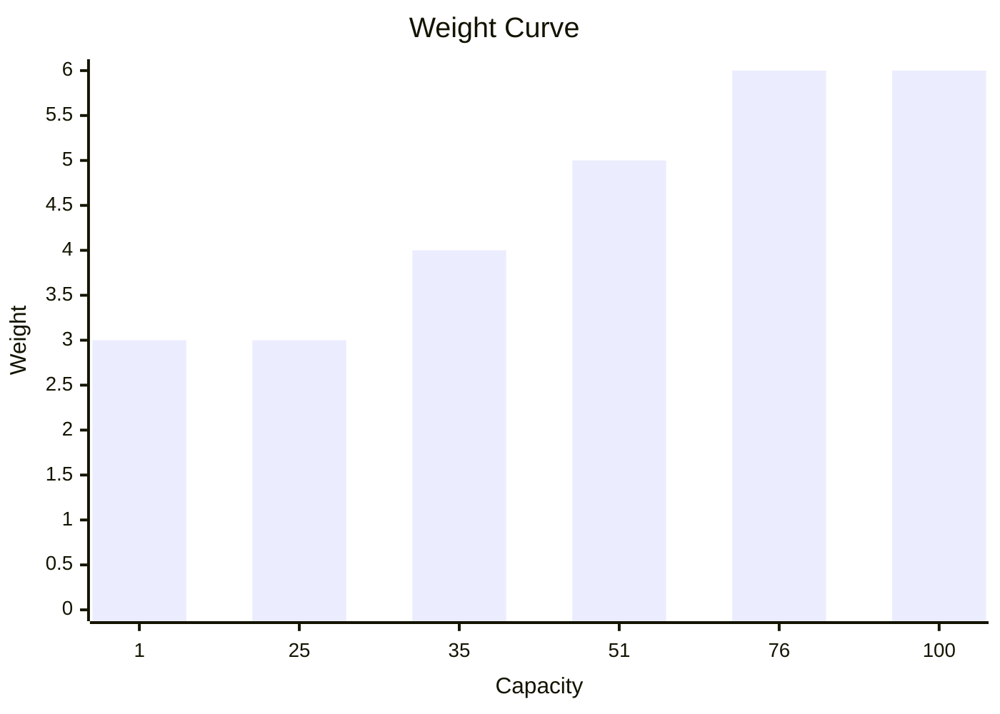

# SharpBotz
## Arena
### Creating A Simple Arena
Construct an `Arena` by calling the static `Create` method,
which takes an `ArenaWidth` and an `ArenaHeight` as arguments:   
```csharp
Arena.Create(
    ArenaWidth.Is(3),
    ArenaHeight.Is(3));
```
This creates a 3 by 3 grid.  
The outer tiles are set up as *Walls*  
```text
Wall Wall Wall
Wall      Wall
Wall Wall Wall
```
Both `ArenaWidth` and `ArenaHeight` must be greater than 2  
### Adding Walls
This can be achieved in the following way:  
```csharp
Arena
    .Create(
        ArenaWidth.Is(5),
        ArenaHeight.Is(3))
    .AddWallAt(1, 1)
    .AddWallAt(3, 1);
```
This creates:  
```text
Wall Wall Wall Wall Wall
Wall Wall      Wall Wall
Wall Wall Wall Wall Wall
```
Placing a wall where one is already present:  
```csharp
Arena
    .Create(
        ArenaWidth.Is(5),
        ArenaHeight.Is(3))
    .AddWallAt(1, 1)
    .AddWallAt(3, 1);
```
Throws a:  
```csharp
ArenaConstructionException
```
Containing the following message:  
```text
"Tried adding a wall to non empty tile at [1, 1].";
```
## Bot
### Modules
Every module is defined by a `ModuleId`.  
```csharp
ModuleId.Is("my-module")
```
A `ModuleId` can not be `null`, `string.Empty` or consist only of whitespace.  
#### Battery
A Battery is created by passing in it's capacity along with a ModuleId.  
```csharp
Battery.Create(ModuleId.Is("battery"), 100);
```
It's initial Charge is set to zero.  
A Battery with a capacity of zero throws upon construction.  
A Battery with a capacity of 1 has a weight of 3.  
Every 25 extra chapacity after the first 25 adds another 1 weight to the module.   

