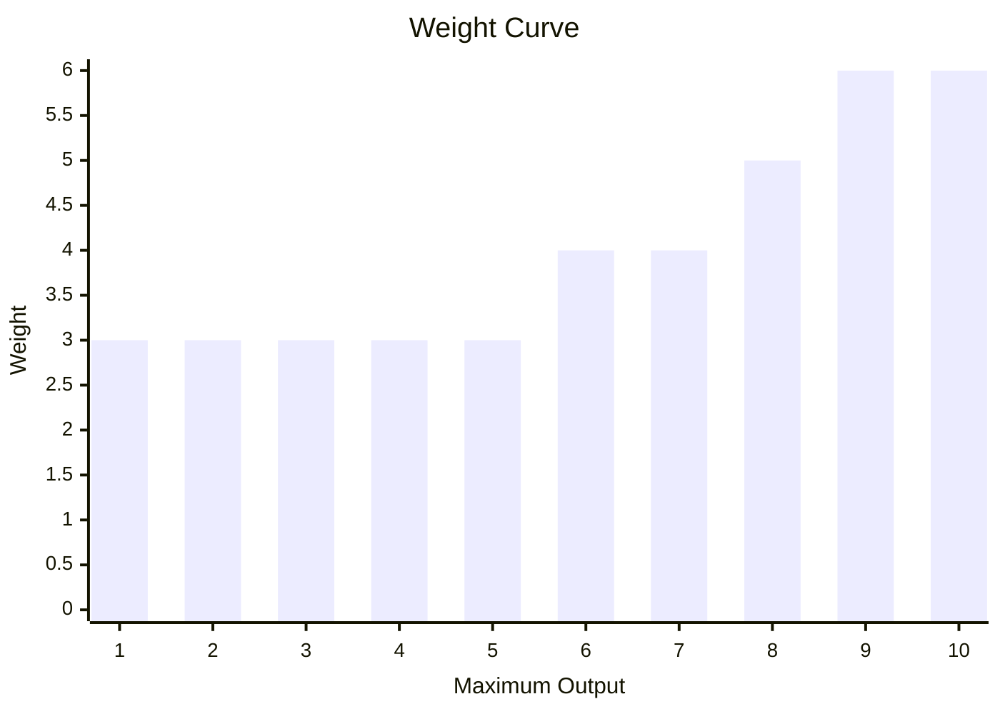
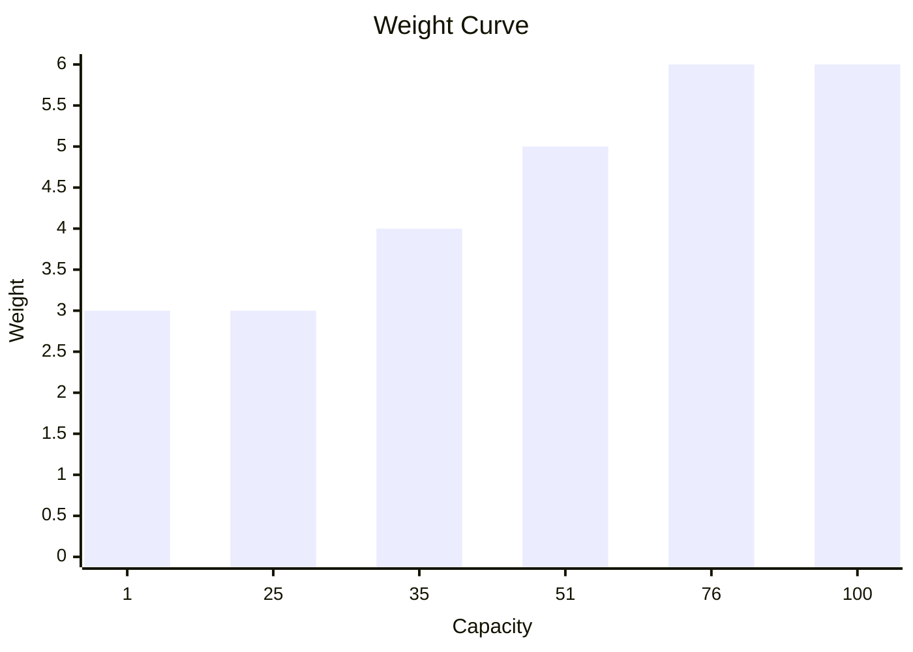

# SharpBotz
## Arena
### Creating A Simple Arena
Construct an `Arena` by calling the static `Create` method,
which takes an `ArenaWidth` and an `ArenaHeight` as arguments:   
```csharp
Arena.Create(
    ArenaWidth.Is(3),
    ArenaHeight.Is(3));
```
This creates a 3 by 3 grid.  
The outer tiles are set up as *Walls*  
```text
Wall Wall Wall
Wall      Wall
Wall Wall Wall
```
Both `ArenaWidth` and `ArenaHeight` must be greater than 2  
### Adding Walls
This can be achieved in the following way:  
```csharp
Arena
    .Create(
        ArenaWidth.Is(5),
        ArenaHeight.Is(3))
    .AddWallAt(1, 1)
    .AddWallAt(3, 1);
```
This creates:  
```text
Wall Wall Wall Wall Wall
Wall Wall      Wall Wall
Wall Wall Wall Wall Wall
```
Placing a wall where one is already present:  
```csharp
Arena
    .Create(
        ArenaWidth.Is(5),
        ArenaHeight.Is(3))
    .AddWallAt(1, 1)
    .AddWallAt(3, 1);
```
Throws a:  
```csharp
ArenaConstructionException
```
Containing the following message:  
```text
"Tried adding a wall to non empty tile at [1, 1].";
```
## Bot
### Modules
Every module is defined by a `ModuleId`.  
```csharp
ModuleId.Is("my-module")
```
A `ModuleId` can not be `null`, `string.Empty` or consist only of whitespace.  
#### Reactor
A reactor is responsible for supplying the energy required to power other modules.

It is created by passing in it's maximum output along with a ModuleId (supplied as string).  
```csharp
Reactor.Create("reactor", 10);
```
It's initial current output is set to maximum output.  
A reactor with a maximum output of zero or negative throws upon construction.  
A reactor with a maximum output of 1 has a weight of 3.  
Increasing maximum output adds more weight exponentialy.   

Multiple rectors can be installed in a ModuleRack.

The total maximum output of the rack is then the sum of all reactors maximum outputs.  
```csharp
ModuleRack.Create(
    Reactor.Create("reactor-one", 10),
    Reactor.Create("reactor-two", 10));
```
#### Battery
A battery is where a Bot stores excess power generated by a Reactor.

It is created by passing in it's capacity along with a ModuleId (supplied as string).  
```csharp
Battery.Create("battery", 100);
```
It's initial Charge is set to zero.  
A battery with a capacity of zero or negative throws upon construction.  
A battery with a capacity of 1 has a weight of 3.  
Every 25 extra capacity after the first 25 adds another 1 weight to the module.   

Multiple batteries can be installed in a ModuleRack.

The total energy capacity of the rack is then the sum of all Battery capacities.  
```csharp
ModuleRack.Create(
    Battery.Create("battery-one", 25),
    Battery.Create("battery-two", 25));
```
